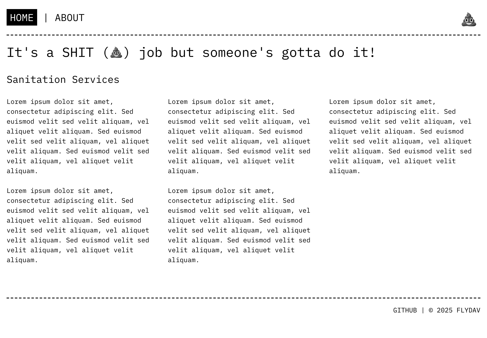
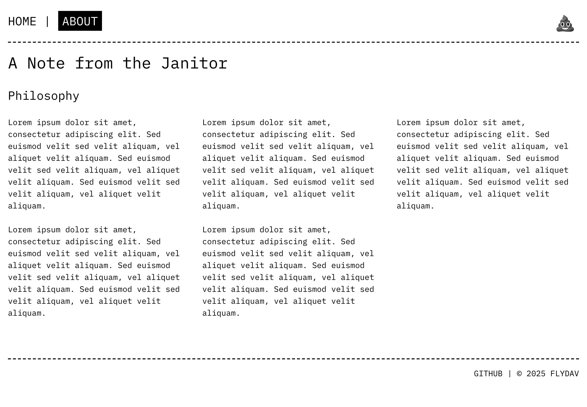
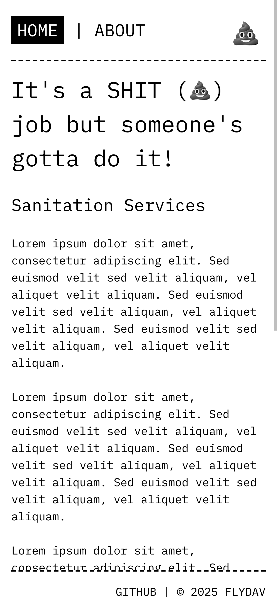

# React + TypeScript + Vite

A modern React project setup with TypeScript, Vite, Vitest, Tailwind CSS, ESLint, and Prettier.

## About This App

This is a simple React application demonstrating modern web development practices. The app features:

- 🏠 **Home Page** - Welcome page with sanitation services theme and grayscale logo
- 📖 **About Page** - Philosophy section with responsive grid layout
- 🧭 **Navigation** - Header with active link highlighting and sticky positioning
- 💩 **Logo** - Grayscale emoji logo with git commit hash tooltip and optional animations (spin, pulse, bounce, wiggle)
- 📱 **Responsive Design** - Mobile-friendly with CSS Grid that adapts from 3 columns to 1

### Screenshots

#### Home Page


#### About Page


#### Mobile View


## Tech Stack

- **React 19** + **TypeScript** - Modern React with type safety
- **Vite** - Fast build tool and dev server
- **Vitest** - Unit testing framework (Vite-native)
- **React Testing Library** - Component testing utilities
- **Tailwind CSS v4** - Utility-first CSS framework
- **ESLint** + **Prettier** - Code quality and formatting
- **Husky** + **lint-staged** - Git hooks for pre-commit linting

## Getting Started

```bash
# Install dependencies
npm install

# Start dev server
npm run dev

# Run tests
npm test

# Run tests with UI
npm run test:ui

# Build for production
npm run build

# Lint code
npm run lint

# Format code
npm run format
```

## Deployment Configuration

This app is configured to be deployed to a subdirectory (e.g., GitHub Pages):

- **Base path**: `/react-scratch/` (configured in `vite.config.ts`)
- **React Router**: Automatically uses the base path via `import.meta.env.BASE_URL`

### Changing the Base Path

To deploy to a different path or root directory:

1. Update `base` in `vite.config.ts`:
   ```js
   export default defineConfig({
     base: '/your-path/',  // or '/' for root
     // ...
   });
   ```

2. React Router will automatically pick up the change (no code changes needed)

### Local Development

During development (`npm run dev`), the app runs at:
- `http://localhost:5173/react-scratch/`

Navigation links work correctly with the base path configured.

## Project Structure

```
src/
  ├── common/           # Shared components (Header, Footer, Logo)
  ├── pages/            # Page components (Home, About)
  ├── App.tsx           # Main app component with routing
  ├── App.test.tsx      # App tests
  ├── main.tsx          # App entry point
  ├── setupTests.ts     # Test setup (jest-dom)
  └── index.css         # Global styles and Tailwind imports
```

## Contributing

Want to contribute? Check out [CONTRIB.md](./CONTRIB.md) for development workflow, code standards, and information about our CI/CD pipelines.

## Code Quality & CI/CD

### Git Hooks (Husky)

This project uses **Husky** and **lint-staged** to enforce code quality before commits:

- **Pre-commit hook**: Automatically runs ESLint and Prettier on staged files
- **Prevents commits** with linting errors
- **Auto-fixes** issues when possible

The hook runs automatically when you commit. No additional setup needed!

### GitHub Actions

#### CI Workflow
The `.github/workflows/ci.yml` workflow runs on every push and pull request:

1. ✅ **ESLint** - Checks code quality
2. ✅ **TypeScript** - Type checking
3. ✅ **Tests** - Runs all unit tests
4. ✅ **Build** - Ensures production build works

Pull requests must pass all checks before merging.

#### Deploy Workflow
The `.github/workflows/deploy.yml` workflow automatically deploys to GitHub Pages:

- **Triggers**: Runs after CI workflow succeeds on `main`/`master` (or manually via GitHub Actions UI)
- **Deployment**: Only deploys if all CI checks pass
- **Live Site**: https://dflynn-vgw.github.io/react-scratch/

### ESLint Rules

- **PascalCase filenames** - Component files must use PascalCase (e.g., `Header.tsx`, not `header.tsx`)
- **React Hooks** - Enforces rules of hooks
- **TypeScript** - Type-aware linting rules

To check linting manually:
```bash
npm run lint
```

Currently, two official plugins are available:

- [@vitejs/plugin-react](https://github.com/vitejs/vite-plugin-react/blob/main/packages/plugin-react) uses [Babel](https://babeljs.io/) (or [oxc](https://oxc.rs) when used in [rolldown-vite](https://vite.dev/guide/rolldown)) for Fast Refresh
- [@vitejs/plugin-react-swc](https://github.com/vitejs/vite-plugin-react/blob/main/packages/plugin-react-swc) uses [SWC](https://swc.rs/) for Fast Refresh

## React Compiler

The React Compiler is not enabled on this template because of its impact on dev & build performances. To add it, see [this documentation](https://react.dev/learn/react-compiler/installation).

## Expanding the ESLint configuration

If you are developing a production application, we recommend updating the configuration to enable type-aware lint rules:

```js
export default defineConfig([
  globalIgnores(['dist']),
  {
    files: ['**/*.{ts,tsx}'],
    extends: [
      // Other configs...

      // Remove tseslint.configs.recommended and replace with this
      tseslint.configs.recommendedTypeChecked,
      // Alternatively, use this for stricter rules
      tseslint.configs.strictTypeChecked,
      // Optionally, add this for stylistic rules
      tseslint.configs.stylisticTypeChecked,

      // Other configs...
    ],
    languageOptions: {
      parserOptions: {
        project: ['./tsconfig.node.json', './tsconfig.app.json'],
        tsconfigRootDir: import.meta.dirname,
      },
      // other options...
    },
  },
])
```

You can also install [eslint-plugin-react-x](https://github.com/Rel1cx/eslint-react/tree/main/packages/plugins/eslint-plugin-react-x) and [eslint-plugin-react-dom](https://github.com/Rel1cx/eslint-react/tree/main/packages/plugins/eslint-plugin-react-dom) for React-specific lint rules:

```js
// eslint.config.js
import reactX from 'eslint-plugin-react-x'
import reactDom from 'eslint-plugin-react-dom'

export default defineConfig([
  globalIgnores(['dist']),
  {
    files: ['**/*.{ts,tsx}'],
    extends: [
      // Other configs...
      // Enable lint rules for React
      reactX.configs['recommended-typescript'],
      // Enable lint rules for React DOM
      reactDom.configs.recommended,
    ],
    languageOptions: {
      parserOptions: {
        project: ['./tsconfig.node.json', './tsconfig.app.json'],
        tsconfigRootDir: import.meta.dirname,
      },
      // other options...
    },
  },
])
```

## Documentation

### Screenshots

Screenshots are referenced in this README but need to be added manually. To add screenshots:

1. Run the development server: `npm run dev`
2. Capture screenshots of the Home page, About page, and mobile view
3. Save them as `home.png`, `about.png`, and `mobile.png` in `./docs/images/`
4. See `./docs/SCREENSHOTS.md` for detailed instructions

### Features Demonstrated

This app showcases:
- **Component organization** - Modular structure with `common/` and `pages/` directories
- **CSS organization** - Component-specific CSS files (e.g., `Header.css`, `Footer.css`)
- **CSS animations** - Logo component with optional animations (see `docs/LOGO_ANIMATIONS.md`)
- **Responsive design** - CSS Grid with responsive breakpoints
- **React Router** - Client-side routing with active link highlighting
- **Git commit tracking** - Logo displays current git commit hash via Vite config
- **Testing** - Component tests with React Testing Library
- **Code quality** - ESLint rules including PascalCase filename enforcement
